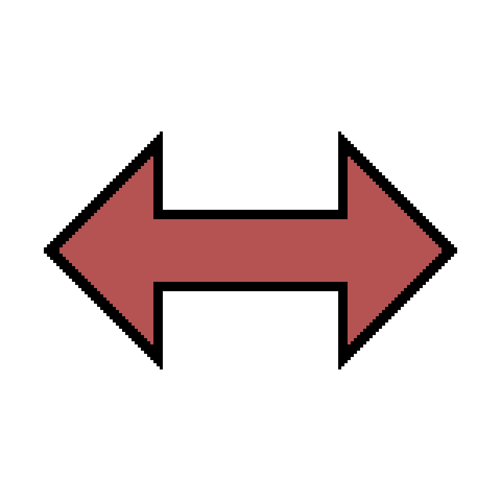
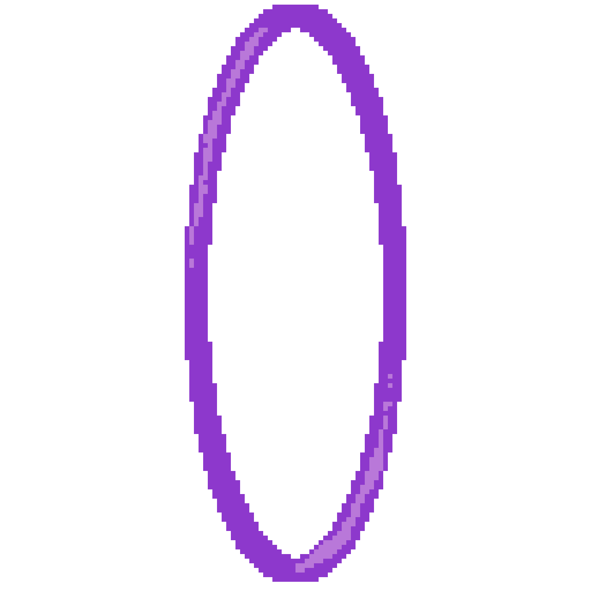
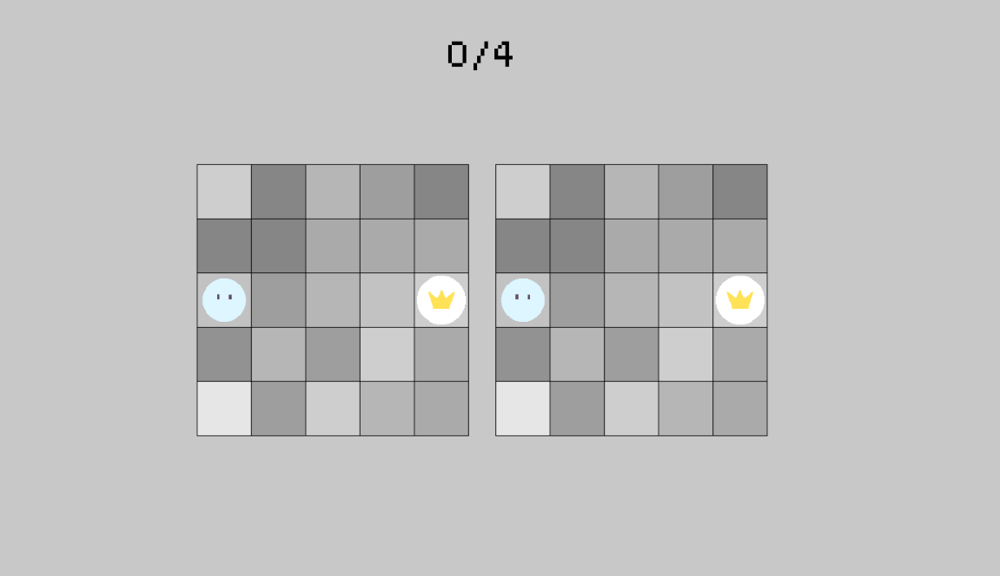

# SHIFT説明文
## 1. オブジェクトの説明
||
|:-:|
|プレイヤー|
|**WASD**で操作できます|

||
|:-:|
|ゴール|
|**プレイヤー**がゴールのマスにいればクリアです 手数を超えると王冠が割れてしまいます。|

||
|:-:|
|障害物|
|プレイヤーはこのマスに**進むことができません。**|

||
|:-:|
|リバース|
|踏むと操作が**上下左右それぞれ反転**します|

||
|:-:|
|ワープ|
|踏むと**もう一つのワープマスまでワープ**します|

## 2. ゲームルール
2つの盤面で**同時に**プレイヤーがゴールマスにいればクリアです。 
画面上部に書かれた**0/4**は手数を表しています。このステージでは**4回の操作**でクリアする必要があります。

## 3. 操作方法
|操作|キー|
|:-:|:-:|
|移動|WASD|
|最初から|R|
|一手戻る|Backspace|
|ゲームを終了する|esc|

## 4. メニュー画面
遊ぶステージを選べます。表示は**world-stage**で書かれています。各worldごとに大まかなstageの特徴があります。
|world|特徴|
|:-:|:-:|
|0|チュートリアル|
|1|障害物|
|2|リバース|
|3|ワープ|
|4|すべて|
|5|サイズ違い|

- **操作方法**

|操作|キー|
|:-:|:-:|
|world選択|WS|
|stage選択|AD|
|あそぶ|Enter|

- **表示される色の意味**
手数以内にクリア
手数は超えているがクリア

